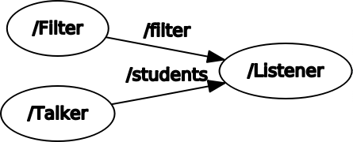
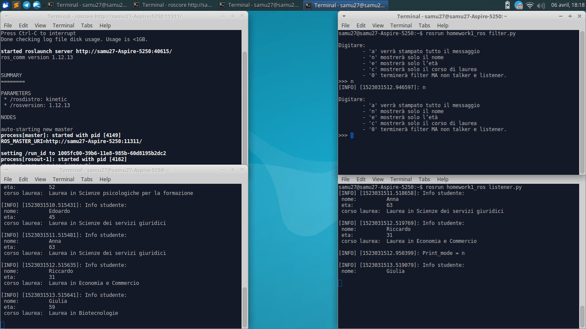

# Homework1 - Laboratorio Ciberfisico UNIVR

Primo esercizio per il Corso di Laboratorio Ciberfisico, Università di Verona.

## Consegna

Si realizzi un package ROS contenente degli opportuni nodi per poter svolgere i compiti seguenti:
 - Un nodo pubblica, 1 volta al secondo, un messaggio contenente un nome, una età, e un corso di laurea 
 - Un nodo permette di selezionare da tastiera quale parte del messaggio verrà mostrata a video (si veda la pagina seguente per i dettagli)
 - Un nodo mostra a video la parte del messaggio selezionata

Il nodo che permette di selezionare da tastiera quale parte del messaggio mostrare dovrà comportarsi nel modo seguente:
 - Digitando ‘a’ verrà stampato tutto il messaggio
 - ‘n’ mostrerà solo il nome
 - ‘e’ mostrerà solo l’età
 - ‘c’ mostrerà solo il corso di laure

## Scelte progettuali

Il progetto si divide in tre nodi:
 - Talker pubblica i messaggi contenenti le informazioni degli studenti sul topic "students"
 - Filter riceve gli input dall'utente e invia sul topic "filter" i comandi
 - Listener riceve messaggi sui topic "students" e "filter" e stampa i dati filtrati

## Grafico



## Come eseguire il programma

Ci sono tre modi per eseguire il programma:
 - launcher 
 - script
 - avvio singoli nodi


#### Avvio tramite launcher

```
roslaunch homework1_ros homework1_launch.launch
```

#### Avvio tramite script

```
cd ~/catkin_ws/src/homework1_ros/
./script/launcher.sh
```

#### Avvio singoli nodi

Terminale1 (**deve essere eseguito per primo**):
```
roscore
```

Terminale2:
```
rosrun homework1_ros talker.py
```

Terminale3:
```
rosrun homework1_ros filter.py
```

Terminale4:
```
rosrun homework1_ros listener.py
```

## Screenshot


Screenshot progetto. Nodi avviati sigolarmente.

## Autore

**Mori Samuele** - [Samu27](https://github.com/Samu27)


## Licenza

Questo progetto è sotto la licenza GPL_v3 - guarda il file [LICENSE.md](LICENSE.md) per ulteriori informazioni

